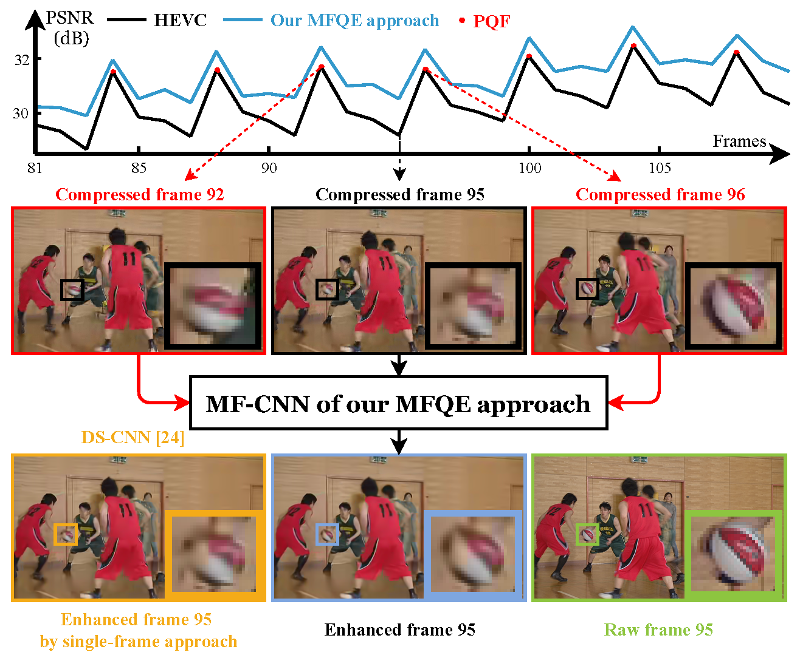
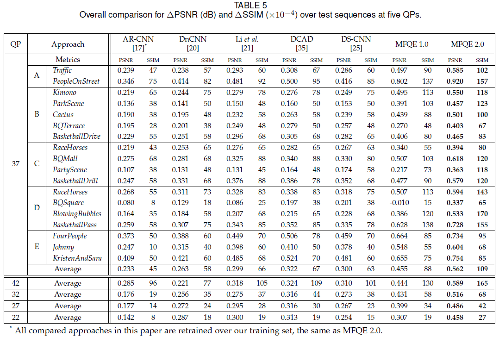

# MFQEv2.0 Demo

***MFQE 2.0: A New Approach for Multi-frame Quality Enhancement on Compressed Video***

*arXiv: http://arxiv.org/abs/1902.09707*

**Note1: This repository is available at [Dropbox](https://www.dropbox.com/sh/s9f9h7kdmetztz9/AAAz6Z1nEovKIqgDsXo34qFia?dl=0).**

**Note2: We enhance PQFs with the help of their neighboring PQFs in this demo, instead of the single-frame approach DS-CNN in the arXiv paper.** The new approach here is much better than the arXiv version and also MFQEv1.0. The arXiv paper will be later updated.

# Recommended Environment

+ Python 3.5
+ TensorFlow 1.8 (1.13 is ok but with warnings)
+ TFLearn (for defining network), NumPy and skimage (for calculating PSNR and SSIM)

# Get Started!

## 1. Preparation

### Download raw and compressed yuv video

We prepare a test video `BasketballPass_416x240_500.yuv` in our [Dropbox](https://www.dropbox.com/sh/s9f9h7kdmetztz9/AAAz6Z1nEovKIqgDsXo34qFia?dl=0). **Download the `Video` folder and put it in the same path with `main_test.py`.** 

Raw videos are stores in subfolder `ori`, while compressed videos are stored in subfolder `cmp`. 

> Compressed videos are obtained by HM16.5-LDP-QP37.
>
> You can also compress the raw videos with other QP settings, and we have already prepared enhancement models ranging from QP = 22 to QP = 42.

You can also test your video. Please rename it as `VideoName_widthxheight_NumOfFrames.yuv`, such as `BasketballPass_416x240_500.yuv`. The test code will extract the video information from the video path.

### Prepare PQF label

We also prepare the estimated PQF labels of `BasketballPass_416x240_500.yuv` in folder `Data`.

These labels are generated by a BiLSTM-based detector. See our paper for more details.

> **For simplicity, you can generate the PQF labels according to the PSNR curves.**
>
> For example, we have a video with only 3 frames, and its PSNR curve is `36.3dB, 38.0dB, 37.9dB`. Then we have PQF labels: `0 1 0`. For more details about the definition and post-processing of PQF labels, please refer to our paper.

### Prepare QP label (optional)

In some cases, there exist frames with different QPs in one video.

You can prepare a `npy` file that **records the QP of each frame in one video**, and store it in folder `Data` as  `ApprQP_VideoName.npy`.

Notice that we have only 5 models with QP22, 27, 32, 37, 42, so we should record the nearest QP for each frame. For example, if the QPs for 4 frames are: `21,28,25,33`, then we should record: `22,27,27,32`. So we call it "approximate QP".

## 2. Run the test code

**Run `main_test.py` in Bash.** All videos in folder `Videos` will be tested successively.

## 3. Results

**The average delta PSNR and delta SSIM results will be recorded in `record_test.txt`**, which are the same with the results presented in our paper:

# Notice

## 1. Scene switch

There may exist scene switch in one video. The frames in different scenes should not be fused.

In this case, we can use SSIM to detect scene switch and cut the video into a few clips. Luckily, it seems that no scene switch exists in the 18 test videos.

## 2. Unqualified non-PQFs

In our MFQE approach, each non-PQF should be enhanced with the help of its neighboring two PQFs (previous one + subsequent one).

However, the PQF label might be something like ('0' is non-PQF and '1' is PQF):

+ 0 0 1 ... (The first 2 non-PQFs have no previous PQFs)
+ ... 1 0 (The last non-PQF has no subsequent PQF)

In these cases, we simply let themselves to be the pre- or sub-PQFs to manage the enhancement.

Also, the first PQF has no previous PQF, and the last PQF has no subsequent PQF. The first PQF serves as the previous PQF for itself, and the last PQF serves as the subsequent PQF for itself.

## 3. Black frame

Enhancing black frames or other "plane" frames may lead to `inf` results.

1. If the middle frame is plane, skip it (do not enhance it). 
2. If the pre- or sub-PQF is plane, do not use it, and simply let the middle frame to be the pre- or sub-PQF to manage the enhancement.

## 4. MF-CNN models

There are two networks in `net_MFCNN.py`. `network2` is for QP = 22, 27, 32 and `network1` for QP = 37, 42.

The performances of these two networks are close.

## 5. Resolution

Even with a 2080Ti GPU, we cannot test `2560x1600` frames (e.g., *Traffic* and *PeopleOnStreet*) at one time. We simply cut them into 4 patches for enhancement and combine the enhanced patches before calculating dPSNR and dSSIM.

For simplicity, the patching and combination processes are omitted in the test code.

## 6. Licenses

You can **use, redistribute, and adapt** the material for **non-commercial purposes**, as long as you give appropriate credit by **citing our paper** and **indicating any changes** that you've made.